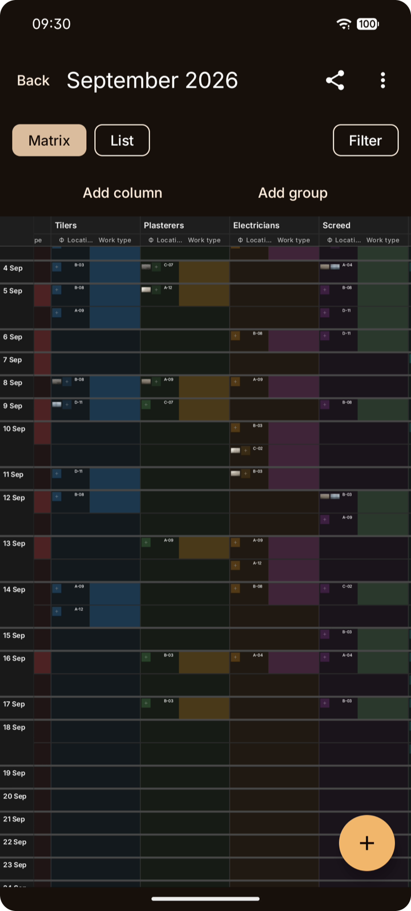
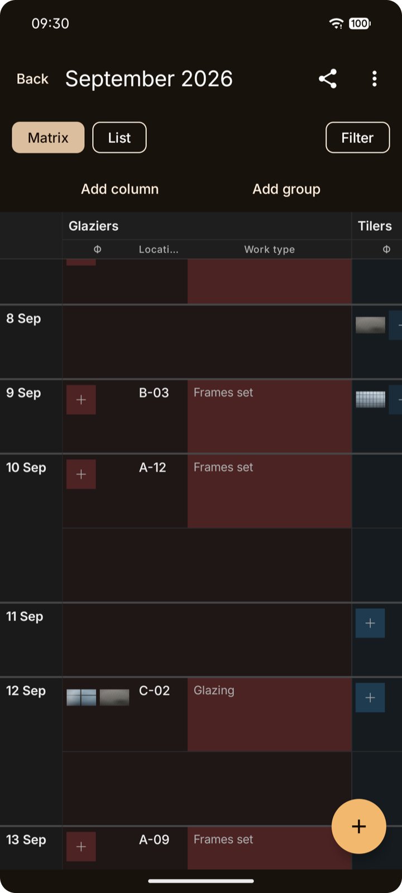

<!-- craft-readme: voice=plain -->
<div align="center">

# PapaSheets

**An offline construction work log for Android**

PapaSheets keeps a date × contractor matrix with two photos per record and exports it to xlsx, photos embedded.


[Guide](docs/GUIDE.md) · [Schema and format rules](docs/evolution.md) · [Spec](docs/spec.md)



</div>

## Zooming out


The whole grid is one `Canvas`, not a tree of composables: at this zoom a month is a few
thousand cells, and that many Compose nodes is a dead end. Where you stopped survives closing
the app. [How the matrix works →](docs/GUIDE.md#the-matrix)

## Quick start with an agent

> Read `AGENTS.md` first. `CLAUDE.md` only imports it. Then run
> `./gradlew :app:testDebugUnitTest :exportkit:test :matrixgrid:test` and tell me what passes.
> Before changing any `@Entity`, read `docs/evolution.md`: an entity change needs a version
> bump, a real `Migration` and a test in `androidTest`, and `fallbackToDestructiveMigration`
> is forbidden. Do not touch the `kmp-port` branch.

## Quick start

```bash
./gradlew :app:assembleDebug          # app/build/outputs/apk/debug/app-debug.apk
./scripts/reinstall-phone.sh          # build and install onto a connected phone, keeping its data
```

JDK 17 and an Android SDK with API 35. The 297 JVM tests run without a device:
`./gradlew :app:testDebugUnitTest :exportkit:test :matrixgrid:test`.
[Every command →](docs/GUIDE.md#building-and-installing)

## Columns are rows in a table



"Location" and "Work type" are rows in the same table as any column a foreman adds, so
filtering and sorting by any column come for free. Leaving the form is saving: on site it gets
collapsed mid-entry, and a started record is worth more than nothing. One long record still
stretches its whole row, and there is no cap on that yet.
[Records and fields →](docs/GUIDE.md#records-and-fields)

## FAQ

**Does it need an account or a network?** Neither. There is no server, and the manifest declares
no `INTERNET` permission. The one permission it does ask for is `WRITE_EXTERNAL_STORAGE`, capped
at API 28, to put a copy of a camera original into the gallery on older releases.

**Why not Apache POI for the xlsx?** It holds the whole workbook in memory, which runs out on a
month with a hundred photos, and it drags in `javax.xml` conflicts. The writer is our own
streaming ZIP and XML in `:exportkit`, pure JVM, pinned byte for byte by tests.

**Will the photos show up in Google Sheets on a phone?** Yes, as long as each picture has at least
10 px of margin in its cell. That number was measured on a device, and the row height and the
photo column width are derived from it. When the cell is tight Sheets draws nothing and the cell
just looks empty. Microsoft Excel on a phone has not been measured.

**Is there an iOS version?** No. A Kotlin Multiplatform port was started on the `kmp-port` branch
and is paused. `main` uses the Android APIs directly.

## Docs

Everything else is in **[docs/GUIDE.md](docs/GUIDE.md)**:
[building and installing](docs/GUIDE.md#building-and-installing) ·
[the matrix](docs/GUIDE.md#the-matrix) ·
[photos](docs/GUIDE.md#photos) ·
[export and import](docs/GUIDE.md#export-and-import).

The invariants for anyone changing the code are in [AGENTS.md](AGENTS.md), and the rules for
changing the schema, the backup format or the xlsx are in [docs/evolution.md](docs/evolution.md).

## License

No licence file yet, so the default applies: all rights reserved.
